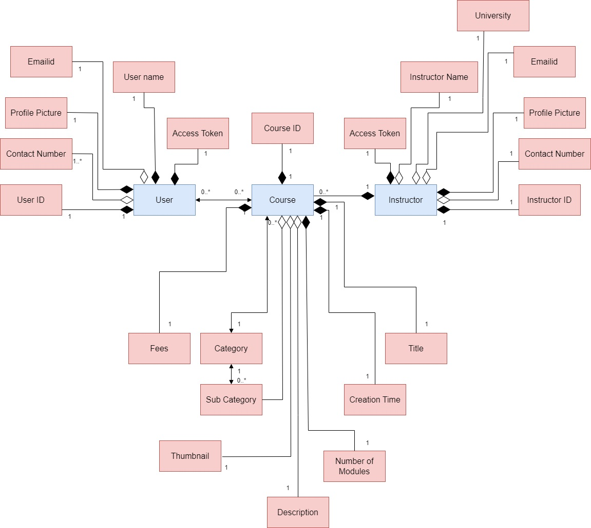
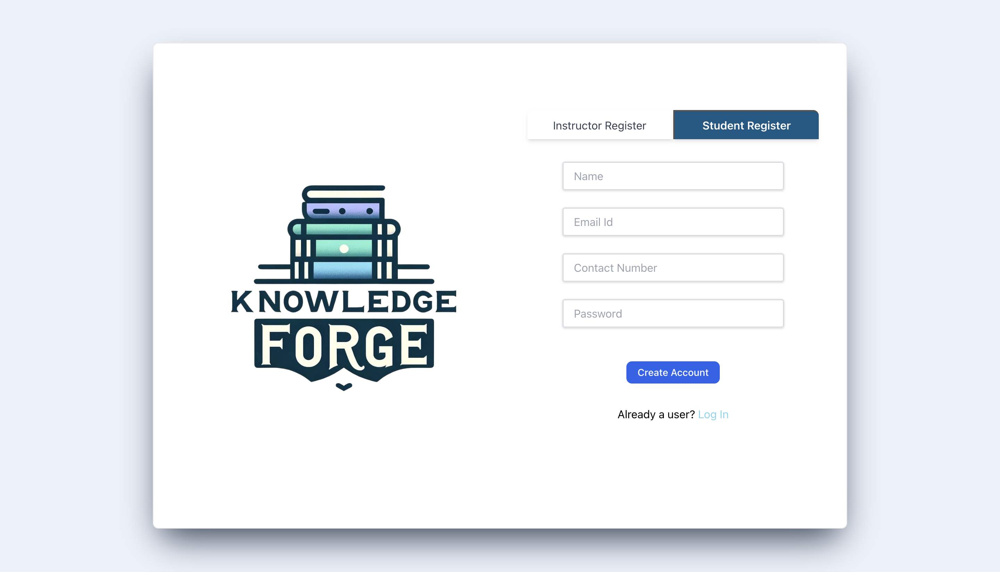
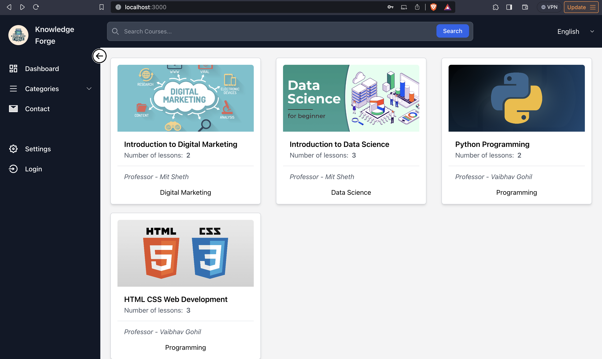
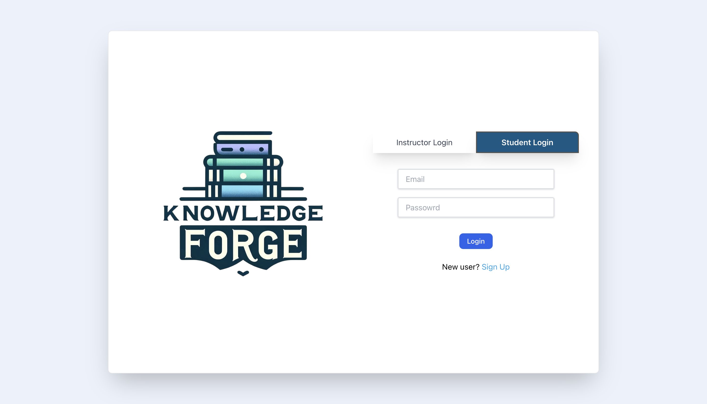
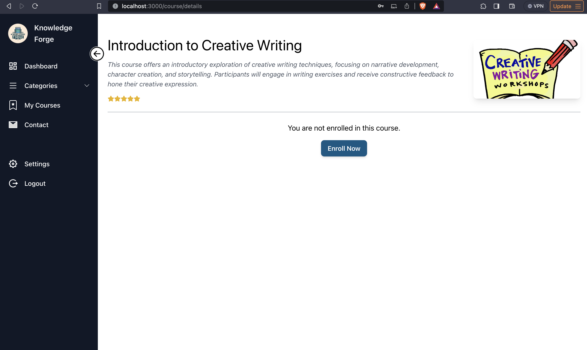
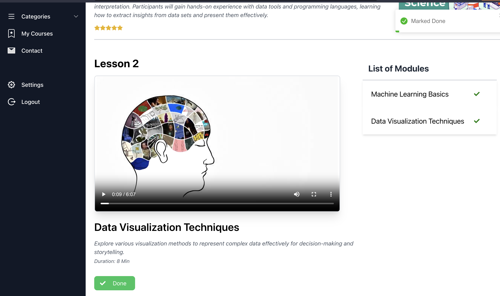
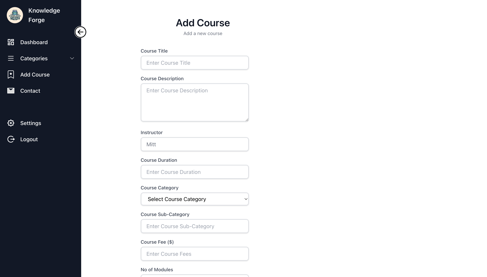
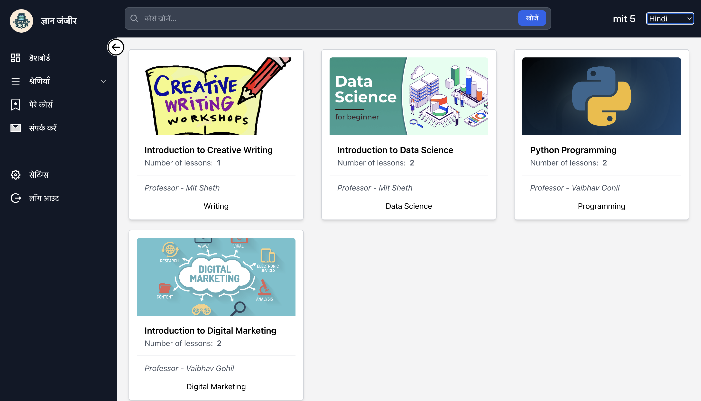
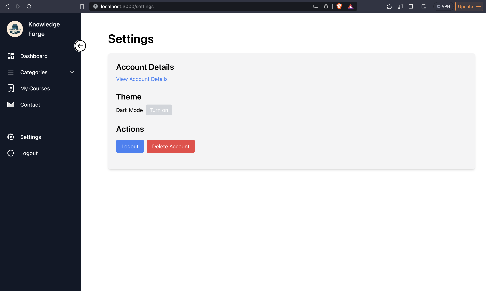
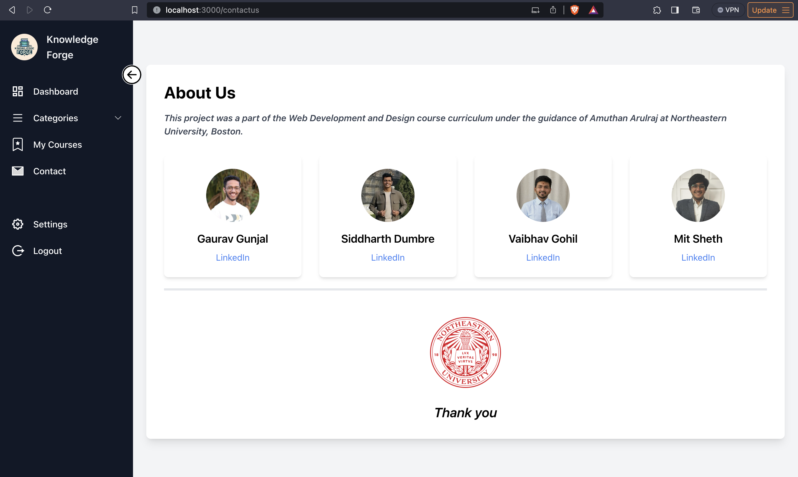

## KnowledgeForge

KnowledgeForge is an innovative online platform designed to seamlessly manage and deliver a wealth of educational resources. This comprehensive hub serves as a dynamic repository for courses, learning materials, and educational content, providing users with a centralized and intuitive interface to explore and enhance their knowledge.


<p float="left">
  
   
  
  
  
  
</p>

## Team Members

Gaurav Gunjal <br>
Siddharth Dumbre <br>
Vaibhav Gohil <br>
Mit Sheth <br>

### TECH USED
  -   React
  -   Node
  -   Mongo db
  -   Express
  -   Redux
  -   TailwindCSS
  -   Mongoose

## DATABASE USED
  - Mongo


## Following is the Entity Relation Diagram of the project



## Project Structure

The project is divided into two main folders:

### KnowledgeForge Server

This folder contains the backend of the application built with Node.js, Express, and MongoDB. It handles the API endpoints, database operations, and authentication.

### KnowledgeForge App

This folder contains the frontend of the application built with React.js. It handles the user interface, interactions, and communication with the backend server.

## Getting Started

### Prerequisites

- Node.js installed globally
- MongoDB installed and running

### Steps to Run the Server

1. **Set up Environment Variables**

   - In the `KnowledgeForge Server` directory, create a `.env` file.
   - Add necessary environment variables (e.g., database connection string,Port number API keys) following the `.env.example` file provided.

2. **Install Dependencies**

   ```bash
   cd KnowledgeForge_server
   npm install
   ```

3. **Run the Server**
   ```bash
   npm start
   ```
   This will start the backend server at `http://localhost:YourPort`.

### Steps to Run the Frontend App

1. **Install Dependencies**

   ```bash
   cd KnowledgeForge-app
   npm install
   ```

2. **Start the App**

   ```bash
   npm start
   ```

   This will launch the frontend application at `http://localhost:3000`.

3. **Connect to the Backend**
   - Ensure the backend server is running at the specified port.
   - Update the frontend's API endpoint configuration (if needed) to match the backend's address.

## Additional Notes

- Remember to restart the server or rebuild the frontend whenever you make changes.
- Refer to individual `README.md` files in each directory for more specific instructions.

## WEB Page Flow

**Register Page**



**Home Page**



**Login Page**



**Course detail for non enrolled users**



**Course Details Page**


**Module Completion**



**Add Course Page for instructor**



**Internationalization**



**Settings Page**



**Team**


